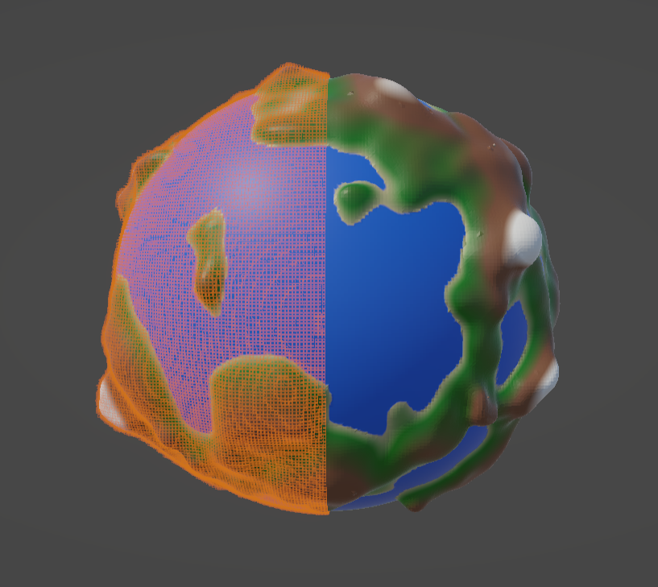
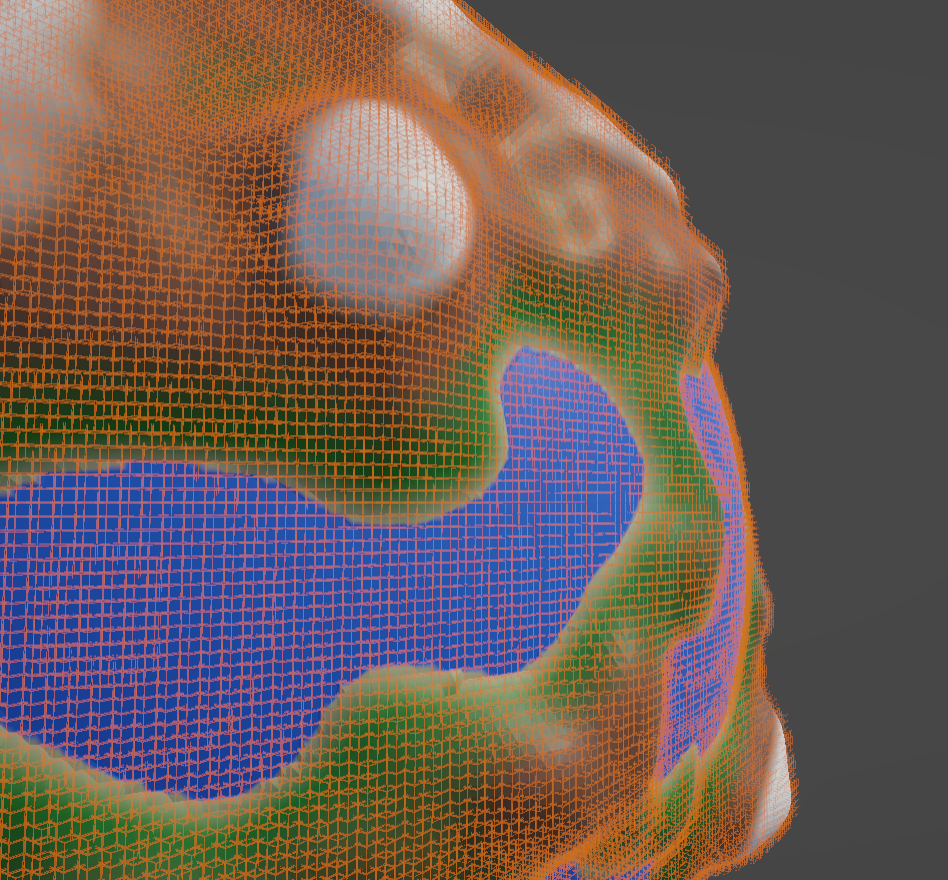
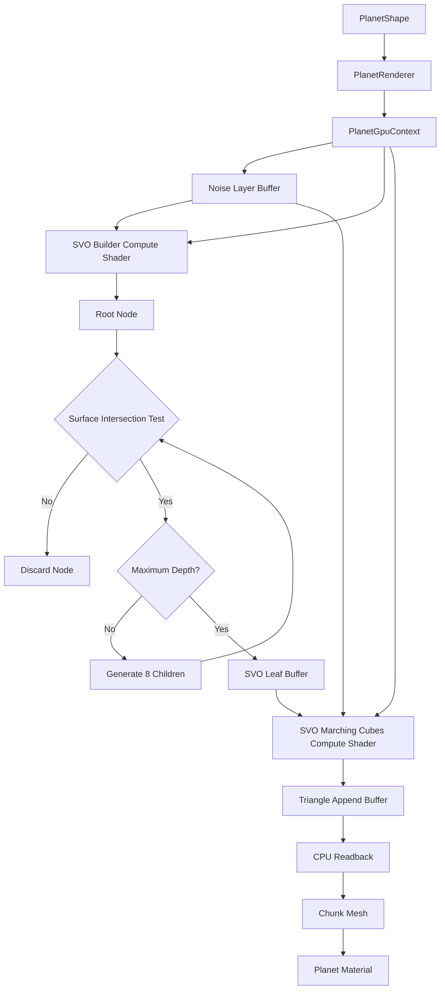

# Planetary Renderer

## **GPU-accelerated planetary surface construction with adaptive Sparse Voxel Octrees (SVOs) and Marching Cubes**

**Bedirhan Sakaoğlu**

------------------------------------------------------------------------

A Unity research project exploring how **adaptive spatial subdivision**
can make procedural planetary mesh generation practical at scales where
a uniform voxel grid becomes prohibitively expensive.

The renderer builds a procedural planetary surface from a signed density
field, constructs an **SVO directly on the GPU**, and runs **Marching
Cubes over the resulting surface-adjacent leaf voxels**. The project
also contains dense-grid CPU/GPU Marching Cubes implementations used
as baselines and development tools.

------------------------------------------------------------------------

## Why this project?

Procedural planets are an unusually difficult isosurface-generation
problem:

-   The final mesh is a thin surface surrounding a very large 3D volume.
-   A uniform grid allocates full-resolution voxels even through empty
    and completely solid regions.
-   Increasing resolution causes the number of dense voxels to grow as
    **O(n³)**.
-   GPU implementations require their working voxel data to fit in video
    memory.

The core idea investigated here is simple:

**Do not spend high-resolution resources on space that cannot contribute
triangles.**

Instead, the renderer recursively subdivides only regions that may
intersect the planetary surface. Large uniform regions remain
represented by large SVO nodes, while unit-sized leaf voxels are
generated near the surface.

------------------------------------------------------------------------

## SVO Visualization

The renderer adaptively subdivides the voxel space around the planetary
surface. Large uniform regions remain represented by coarse SVO nodes,
while regions near the surface are recursively subdivided into leaf voxels.



*Adaptive SVO subdivision surrounding the procedurally generated planetary
surface.*



*Close-up of the surface-localized SVO leaf nodes.*

------------------------------------------------------------------------

## Key Features

### Procedural planetary terrain

-   Spherical base density field.
-   Multi-layer fractal simplex noise for terrain elevation.
-   Configurable noise layers with:
    -   octaves
    -   amplitude
    -   frequency
    -   lacunarity
    -   persistence
    -   spatial offset
-   Gradient-based planet coloring driven by surface elevation.

### GPU-first SVO construction

The main planetary pipeline is implemented using Unity Compute Shaders:

1.  Create a root SVO node for a chunk.
2.  Test whether the node can intersect the planetary surface.
3.  Reject nodes that are safely outside the possible surface region.
4.  Subdivide surviving nodes recursively.
5.  Stop at the configured maximum depth.
6.  Store surface-adjacent nodes as leaf voxels.
7.  Run Marching Cubes over the leaves.

This avoids constructing and processing a full-resolution voxel volume
for the majority of planetary space.

### Marching Cubes

The project contains:

-   GPU Marching Cubes using an append buffer for generated triangles.
-   A CPU Marching Cubes implementation.
-   A dense-grid GPU path used during development and comparison.
-   Shared lookup tables and interpolation utilities in HLSL.

Each active SVO leaf samples its eight corners, computes its 8-bit
Marching Cubes configuration, and emits up to five triangles through an
`AppendStructuredBuffer`.

### GPU memory management

The C# / HLSL boundary is explicitly managed through `ComputeBuffers`:

-   Double-buffered SVO levels.
-   Dedicated leaf-node buffer.
-   Dynamically sized triangle buffer.
-   Structured noise-layer buffer.
-   GPU append counters for variable-length output.
-   Explicit buffer lifetime management through `IDisposable`.

The `PlanetGpuContext` class centralizes this GPU resource management
and dispatch orchestration.

### Research-oriented implementation

The repository is not only a visual demo. It contains multiple
implementations and debugging paths intended to investigate the
underlying algorithms:

-   Dense grid subdivision.
-   Hierarchical SVO subdivision.
-   CPU Marching Cubes.
-   GPU Marching Cubes.
-   Marching Tetrahedra lookup data.
-   SVO leaf visualization.
-   Dense-grid visualization.
-   Custom Unity inspectors for triggering generation and updating
    parameters.

------------------------------------------------------------------------

## Architecture



The important separation is between **orchestration** and **GPU work**:

-   `PlanetRenderer` owns the high-level planet/chunk lifecycle.
-   `PlanetGpuContext` manages GPU resources and dispatches.
-   `SVOBuilder.compute` performs adaptive spatial subdivision.
-   `SVOMarchingCubes.compute` converts leaf voxels into triangles.
-   HLSL include files contain reusable density, noise, interpolation,
    and Marching Cubes logic.
-   `Chunk` converts GPU-generated triangles into Unity meshes.

------------------------------------------------------------------------

## SVO Pipeline

### 1. Chunk initialization

The planet is partitioned into configurable chunks. Each chunk is
represented by a `Chunk` component containing its generated mesh.

The default renderer exposes:

-   voxel resolution per axis
-   voxel spacing
-   number of chunks on X/Y/Z
-   chunks processed per iteration
-   planet material
-   compute shaders

### 2. Conservative surface culling

Before recursively subdividing a node, the SVO builder performs a cheap
sphere-based intersection test.

The culling test accounts for the configured maximum terrain
displacement, allowing the hierarchy to reject regions that cannot reach
the planetary surface.

### 3. Surface-aware refinement

Near the maximum depth, the implementation performs a more precise
**corner/center density straddle test**. A node survives when its
sampled density values indicate that the isosurface may pass through it.

This is the key difference from a dense grid: **high-resolution voxels
are concentrated around the surface rather than filling the entire
volume.**

### 4. Isosurface extraction

Every surviving leaf is evaluated by the GPU Marching Cubes kernel:

-   sample eight leaf corners
-   classify the corners
-   construct the Marching Cubes configuration
-   look up the corresponding edge/triangle configuration
-   interpolate vertices along intersected edges
-   append triangles to a GPU buffer

The triangle buffer is sized from the worst-case **five triangles per
voxel** bound and can grow when required.

------------------------------------------------------------------------

## Density Field

The terrain is represented as an implicit surface rather than a
pre-built mesh.

For a world-space position `p`, the implementation combines:

1.  A spherical base surface.
2.  Fractal simplex-noise displacement.

Conceptually:

``` text
density(p) = distance_from_center(p)
           - (planet_radius + terrain_noise(p))
```

The HLSL implementation evaluates multiple noise layers:

``` text
for each noise layer:
    for each octave:
        value += simplex_noise(position * frequency + offset) * amplitude
        frequency *= lacunarity
        amplitude  *= persistence
```

The same simplex-noise formulation is also ported to C# in `Noise.cs`,
providing a CPU-side implementation for development and experimentation.

------------------------------------------------------------------------

## Dense Grid vs. SVO

The repository includes dense-grid code alongside the adaptive
implementation because the central engineering question is not simply
*"Can a planet be generated?"* but:

> **How should the 3D domain be represented so that high-resolution
> surface extraction remains practical?**

### Dense grid

A uniform grid is straightforward and provides constant-time indexing,
but every region is represented at full resolution.

For `n` voxels per axis:

``` text
N = n³
```

So memory scales as:

``` text
O(n³)
```

This becomes problematic for planetary-scale domains because most of the
volume does not contribute to the surface mesh.

### Sparse voxel octree

The SVO retains coarse nodes in uniform regions and recursively refines
only potentially relevant regions.

For an approximately spherical surface, the surface area scales with:

``` text
O(r²)
```

and assuming the number of voxels on the surface grow with the surface are it scales approximately as:

``` text
O(n²)
```

For a planet with a 1 km radius and 800 m maximum elevation, its simplified
dense-grid estimate reaches approximately **1.49 TB**, while the
corresponding SVO estimate is approximately **1.3 GB** under the
project's voxel memory model.

These figures are **analytical estimates, not
benchmark measurements of a specific GPU**.

------------------------------------------------------------------------

## GPU Implementation Details

A few implementation details are particularly relevant to the
performance characteristics of the project.

### Append buffers

The GPU does not know the final number of generated SVO nodes or
triangles in advance. The implementation therefore uses Unity append
buffers for:

-   next SVO level
-   leaf nodes
-   generated triangles

After each dispatch, `ComputeBuffer.CopyCount` is used to retrieve the
number of generated elements.

### Level-by-level SVO construction

The SVO builder alternates between two buffers:

``` text
SVO A → SVO B → SVO A → SVO B → ...
```

This avoids repeatedly allocating buffers for each tree level while
allowing each level to be processed independently.

### GPU-side traversal of work

Rather than launching one GPU thread per potential voxel in the entire
planetary volume, the SVO builder launches work over the **currently
surviving nodes**.

The Marching Cubes stage then launches one GPU thread per SVO leaf.

### CPU/GPU boundary

The final triangle data is read back to the CPU and converted into Unity
`Mesh` objects. Each chunk uses a dynamically marked mesh and 32-bit
indices to accommodate large generated meshes.

------------------------------------------------------------------------

## Project Structure

``` text
Assets/
├── Editor/
│   └── create-a-custom-inspector/
│       ├── MarchingCubesInspector.cs
│       └── PlanetRendererInspector.cs
│
├── PlanetSettings/
│   ├── PlanetShape.cs
│   └── PlanetColors.cs
│
├── Scripts/
│   ├── Planet/
│   │   ├── Chunk.cs
│   │   ├── MarchingCubes.cs
│   │   ├── MarchingTable.cs
│   │   ├── Noise.cs
│   │   ├── PlanetGpuContext.cs
│   │   ├── PlanetRenderer.cs
│   │   └── Debug/
│   │       ├── DenseGridOverlay.cs
│   │       └── SvoLeafOverlay.cs
│   │
│   └── Compute/
│       ├── SVOBuilder.compute
│       ├── SVOMarchingCubes.compute
│       ├── DenseGridFull.compute
│       ├── MarchChunks.compute
│       ├── FractalNoiseGenerator.compute
│       └── Includes/
│           ├── ComputeUtils.hlsl
│           ├── MarchingTables.hlsl
│           ├── MarchingTetrahedra.hlsl
│           ├── Noise.hlsl
│           └── SVOShared.hlsl
│
├── Scenes/
│   └── PlanetScene.unity
│
└── Shaders/
    └── Planet.shadergraph
```

------------------------------------------------------------------------

## Development / Debugging Tools

The custom inspectors expose convenient generation controls directly in
the Unity Editor.

For `PlanetRenderer`:

-   **Generate Mesh**
-   **Update Colors**
-   live editing of `PlanetShape`
-   live editing of `PlanetColors`

For the standalone `MarchingCubes` component:

-   **Generate (CPU)**
-   **Generate (GPU)**

The project also contains debug overlays for visualizing:

-   dense-grid voxel allocation
-   SVO leaf allocation

These are useful for directly seeing the difference between
**volume-wide subdivision** and **surface-localized subdivision**.

------------------------------------------------------------------------

## Technical Takeaways

This project explores several graphics/compute concepts that are
directly relevant to real-time rendering and GPU programming:

-   Procedural implicit surfaces
-   Signed density fields
-   Marching Cubes
-   Marching Tetrahedra
-   Sparse Voxel Octrees
-   Adaptive spatial subdivision
-   GPU compute shaders
-   HLSL
-   Structured and append buffers
-   GPU-to-CPU data transfer
-   Parallel work dispatch
-   Procedural terrain generation
-   Chunked mesh generation
-   Runtime GPU resource management
-   Unity editor tooling

The main engineering trade-off is deliberately exposed:

> **Dense grids provide simple, regular memory access, while SVOs
> introduce irregular traversal in exchange for dramatically reducing
> the amount of space that must be represented and processed.**

The project investigates why that trade-off is worthwhile for planetary
surfaces, where the geometry occupies only a small fraction of the
surrounding 3D domain.
